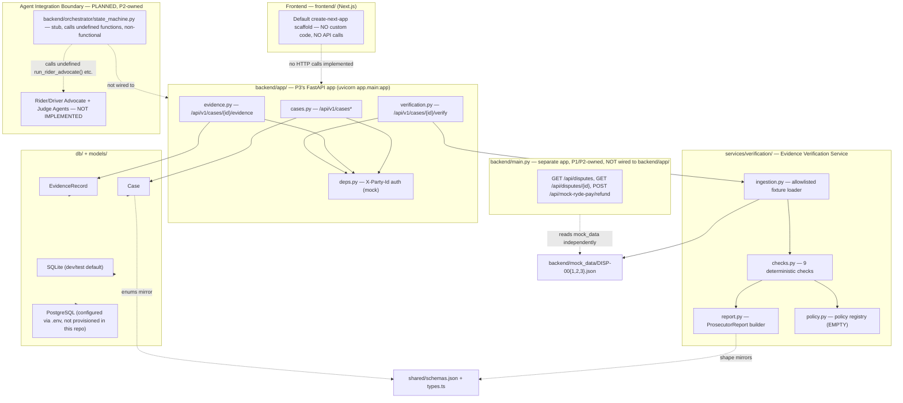
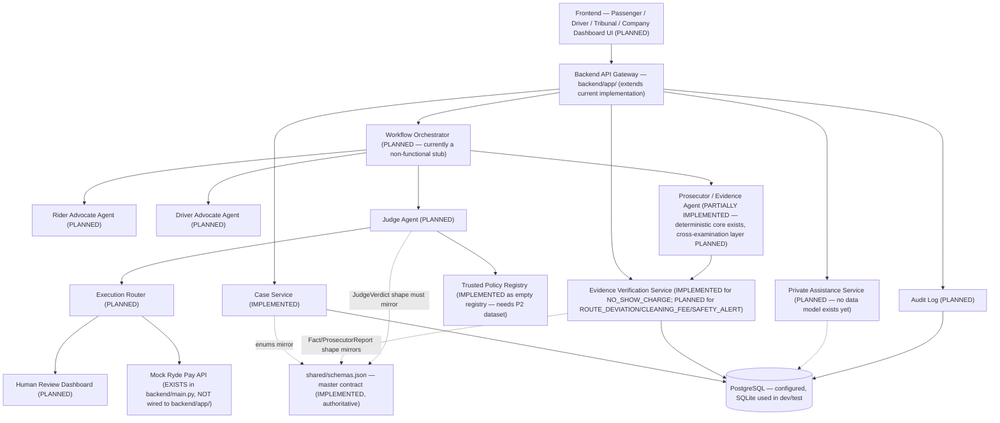

# MIRRA AI — P3 Backend Development Status, Remaining Work & Final Goal

**Audience:** P3, P1, P2, and the project team
**Repository:** `Mirra-AI` · **Branch:** `feature/p3-backend-evidence`
**Status legend:** `IMPLEMENTED` · `TESTED` · `PLANNED` · `PROPOSED` · `BLOCKED` · `TBD`

---

## A. Project Overview

MIRRA AI (Multi-Agent Intelligent Resolution & Reconciliation Assistant) is built for the Tencent Cloud "AI CAN DO IT" Hackathon Singapore 2026, Digital Native Track, sponsored by Ryde. The Handbook's challenge statement ("Multi-Agent Autonomous Dispute Resolution System") asks for an autonomous, multi-agent system that gathers evidence, applies company policy, and issues fair rulings for ride-hailing disputes (fare disputes, route deviations, property damage, no-shows) — quickly, transparently, and mostly without human intervention.

项目目标（中文）：MIRRA AI 希望用多智能体系统自动处理 Ryde 平台上的乘客-司机纠纷，从"私密 AI 助理"沟通开始，到"AI 法庭"正式裁决结束，目标是把平均 24–72 小时的人工处理时间缩短为分钟级，同时保证裁决的一致性和可追溯性。

The Handbook (Section "1. MVP (Required) — Core Agents") requires three core agents operating on text/structured evidence: **Rider Advocate**, **Driver Advocate**, **Judge**, handling at least 2 of 4 sample dispute categories (Route Deviation, No-Show Charge, Property Damage/Mess, Safety Incident) end-to-end by Demo Day.

---

## B. P3 Responsibilities

Per the team's own role assignment (`workflow.md`, "Team Role Assignment") and the working division used throughout this project:

- **Backend architecture** — the FastAPI application structure, database layer, configuration.
- **Case API** — case intake, retrieval, party-scoped access.
- **Evidence Intelligence** — the deterministic Prosecutor/Evidence verification engine.
- **Database** — schema, migrations (SQLAlchemy + Alembic + PostgreSQL, SQLite for dev/test).
- **API contracts** — keeping the backend's Pydantic schemas aligned with `shared/schemas.json`.
- **Access control** — party-scoped authorization (currently mock-header-based).
- **Audit logging, execution safeguards** — `PLANNED`, not yet built (see Section H).
- **Backend integration** — the boundary P1's orchestrator and P2's agents call into.

**Explicit non-ownership:** P3 does not own the frontend, the orchestrator's state-transition logic, or any agent's reasoning/LLM behaviour — those are P1/P2 territory per `MIRRA_P1_INTEGRATION_HANDOFF.md` and `MIRRA_P2_AGENT_INTEGRATION_HANDOFF.md`.

---

## C. Repository Status

Verified directly via `git branch --show-current`, `git log`, `git status -sb`, `git remote -v`, `git rev-list --left-right --count origin/feature/p3-backend-evidence...HEAD`, run fresh for this document:

- **Current branch:** `feature/p3-backend-evidence`
- **Latest commit:** `8fe1bbc` — `feat(p3): implement and secure deterministic evidence verification` (author `CTMX-Zhen`)
- **Remote:** `origin` → `https://github.com/astridya11/Mirra-AI.git`
- **Push status:** `0` ahead / `0` behind `origin/feature/p3-backend-evidence` — **the branch is fully pushed and in sync with the remote.**
- **Uncommitted/untracked files:** two, both pre-existing and unrelated to P3's backend work: `AI CAN DO IT Tencent Cloud AI Singapore Hackathon 2026 Handbook.pdf`, `MIRRA_P3_CreateBranch.ps1`. Working tree is otherwise clean.
- **Commit history (full, oldest first):** `235f767` initialize project structure → `ee6d27e` workflow.md + shared schemas → `6d71d80` mock data + mock dispute API → `ad33bda` schema refinement, Round 3 removed → `f2611ca` **P3 M0+M1**: FastAPI backend foundation → `8fe1bbc` **P3 M2A**: evidence verification, implemented and security-fixed.

**Actual project structure** (verified via directory listing, not assumed):
```
backend/
  main.py                    # P1/P2 legacy mock endpoints — separate FastAPI app, NOT wired to backend/app/
  orchestrator/state_machine.py  # P1/P2 stub, non-functional (calls undefined functions)
  mock_data/{DISP-001,002,003}.json
  requirements.txt
  alembic.ini, alembic/      # P3, Milestone 1
  app/                       # P3's actual backend
    main.py                  # FastAPI entrypoint (run via `uvicorn app.main:app`)
    core/config.py           # Pydantic Settings
    db/{base,session}.py     # SQLAlchemy engine/session
    models/{case,evidence}.py
    schemas/{case,evidence,verification}.py
    api/{deps}.py
    api/routes/{cases,evidence,verification}.py
    services/verification/{ingestion,checks,report,policy}.py
  tests/{conftest,test_cases,test_evidence,test_verification}.py
frontend/                    # default `create-next-app` scaffold, zero custom code (verified: page.tsx is the stock template)
shared/{schemas.json,types.ts}  # master data contract, types.ts auto-generated from schemas.json
workflow.md                  # authoritative 4-phase workflow spec
README.md
```

**Backend entrypoints (two, not merged — this is a known duplication, see Section H):**
1. `backend/main.py` — `FastAPI(title="Ryde Multi-Agent Dispute Resolution System - Mirra AI")`, 3 mock endpoints (`GET /api/disputes`, `GET /api/disputes/{id}`, `POST /api/mock-ryde-pay/refund`), reads `backend/mock_data/` via a hardcoded relative path, no database.
2. `backend/app/main.py` — P3's real backend, `/api/v1/*` prefix, SQLAlchemy-backed, the one documented throughout this handoff.

**Shared contract location:** `shared/schemas.json` (JSON Schema, hand-authored master) and `shared/types.ts` (auto-generated TypeScript mirror via `json-schema-to-typescript`, confirmed field-for-field identical by direct inspection).

---

## D. Completed Milestones

### Milestone 0 + 1 — Backend Foundation
- **Objective:** Modular FastAPI architecture, PostgreSQL/SQLAlchemy/Alembic/Pydantic configuration, Case API, party-scoped access ("Private Assistance" in the access-control sense — see caveat in Section G), basic evidence records, OpenAPI contract, automated tests.
- **Implemented modules:** `app/core/config.py`, `app/db/{base,session}.py`, `app/models/{case,evidence}.py`, `app/schemas/{case,evidence}.py`, `app/api/deps.py`, `app/api/routes/{cases,evidence}.py`, `app/main.py`.
- **Database changes:** Alembic revision `3007c4397bd8_create_cases_and_evidence_records.py` — creates `cases` and `evidence_records` tables. Confirmed committed and tracked (`git ls-files backend/alembic/versions/`).
- **APIs:** `POST/GET /api/v1/cases`, `GET /api/v1/cases/{id}`, `POST/GET /api/v1/cases/{id}/evidence` (full contract in `MIRRA_P1_INTEGRATION_HANDOFF.md` Section B).
- **Tests:** `backend/tests/test_cases.py`, `test_evidence.py` — 11 tests.
- **Security work:** none specific to this milestone (the party-scoping mechanism itself was reviewed and found sound in Milestone 2A's review).
- **Limitations:** `X-Party-Id` is a mock header, not real auth (documented in code, `app/api/deps.py`); `CaseCreate.case_id` has no format validation at creation time (contributed to a path-traversal finding fixed in M2A — see below).
- **Completion status: DONE.**

### Milestone 2A — Deterministic Evidence Verification for DISP-002
- **Objective:** A deterministic (non-LLM) Prosecutor/Evidence verification engine for the `NO_SHOW_CHARGE` dispute type, producing a `ProsecutorReport`-shaped output.
- **Implemented modules:** `app/services/verification/{ingestion,checks,report,policy}.py`, `app/schemas/verification.py`, `app/api/routes/verification.py`.
- **APIs:** `POST /api/v1/cases/{id}/verify` (full contract, `MIRRA_P1_INTEGRATION_HANDOFF.md` Section B.7).
- **Database changes:** none (this milestone is stateless — see Section G).
- **Tests:** `backend/tests/test_verification.py` — 47 tests.
- **Security work (this is the notable part of this milestone):** an independent code review (performed before committing) found and confirmed three issues, all fixed before commit `8fe1bbc`:
  1. **Path traversal** in `load_case_data` — fixed with a strict format regex + hardcoded fixture allowlist (`DISP-001/002/003` only) + resolved-path containment check.
  2. **Caller-controlled policy thresholds** — the API accepted `policy_params` from either disputing party, letting them bias the eligibility finding; fixed by removing the parameter entirely and introducing a backend-only policy registry (`policy.py`) that returns `None` (unresolved) rather than inventing numbers.
  3. **Unhandled malformed-timestamp exceptions** — `datetime.fromisoformat` calls with no guard would crash the endpoint on bad input; fixed with safe parsing that degrades to `MISSING`/`DISPUTED` facts. Two additional crash sites in the same category (`check_event_ordering`, `check_missing_gps_records`, both raw `<`/`<=` comparisons that fail on mixed timezone-aware/naive datetimes) were found by the *new regression tests written for this fix* and fixed in the same pass.
- **Limitations:** documented in full in Section G/H below (policy registry empty, stateless reports, `TRIP-DATA` evidence-id fallback, hardcoded confidence values).
- **Completion status: DONE** (as a deterministic evidence engine for `NO_SHOW_CHARGE`; explicitly not a route-deviation or image/EXIF engine — those are unstarted, see Section I).

### Test verification (run fresh for this document)
```
cd backend && ./venv/Scripts/python -m pytest -q
```
**Result: 58 passed, 2 warnings** (both pre-existing/cosmetic: `httpx`/`starlette.testclient` deprecation notice, `HTTP_422_UNPROCESSABLE_ENTITY` naming deprecation in Starlette — no functional impact). Reproduced independently for this document, matching the previously reported count.

---

## E. Current Backend Architecture



**Implemented (solid arrows above):** `P3App`, `EvidenceEngine`, `DBLayer` (SQLite path), `MockData` access, schema alignment. **Planned/non-functional (dashed arrows):** frontend integration, PostgreSQL provisioning, orchestrator↔agent↔backend wiring, `LegacyApp`↔`P3App` unification.

---

## F. Existing API Reference

Full request/response bodies and examples are documented once, in `MIRRA_P1_INTEGRATION_HANDOFF.md` Section B, to avoid drift between documents. Summary table:

| Method | Route | Purpose | Auth | Status |
|---|---|---|---|---|
| GET | `/health` | Liveness | none | IMPLEMENTED |
| POST | `/api/v1/cases` | Create case | none (gap, see H) | IMPLEMENTED, TESTED |
| GET | `/api/v1/cases` | List my cases | `X-Party-Id` | IMPLEMENTED, TESTED |
| GET | `/api/v1/cases/{id}` | Read one case | `X-Party-Id`, party-scoped | IMPLEMENTED, TESTED |
| POST | `/api/v1/cases/{id}/evidence` | Add basic evidence record | `X-Party-Id`, party-scoped | IMPLEMENTED, TESTED |
| GET | `/api/v1/cases/{id}/evidence` | List basic evidence records | `X-Party-Id`, party-scoped | IMPLEMENTED, TESTED |
| POST | `/api/v1/cases/{id}/verify` | Run deterministic evidence verification | `X-Party-Id`, party-scoped, fixture-allowlisted | IMPLEMENTED, TESTED |

OpenAPI: auto-generated, `/openapi.json` + `/docs`, always current (FastAPI default, no manual maintenance needed).

---

## G. Evidence Engine Status

**What `POST /api/v1/cases/{id}/verify` can currently prove, for `DISP-002` (`NO_SHOW_CHARGE`):**
- Whether the recorded driver arrival time is consistent across trip data, app events, GPS, and chat (it is, for `DISP-002` — real output in `MIRRA_P2_AGENT_INTEGRATION_HANDOFF.md` Section C).
- The actual elapsed waiting duration (480s / 8min for `DISP-002`), computed independently of any policy.
- Whether the GPS-recorded arrival point matches the declared pickup location (0m for `DISP-002`).
- Whether a driver communication attempt (call) is corroborated between app events and chat.
- Whether the cancellation timestamp is internally consistent.
- Whether the full app-event timeline is chronologically ordered.
- Whether GPS coverage during the wait period has gaps >120s (yes, for `DISP-002` — 2 gaps).
- Whether trip-data timestamps contradict each other (e.g. arrival after cancellation).

**What it cannot currently prove:**
- **Policy eligibility** — `check_policy_eligibility` always returns `MISSING` today because `policy.py`'s registry is empty (Section D). No case can be told "this fee was/wasn't justified per policy" yet.
- Anything about `ROUTE_DEVIATION` deviation distance, `CLEANING_FEE` photo/EXIF validity, or `SAFETY_ALERT` keyword detection — no checks exist for these.
- Fraud risk or safety risk scoring (schema exists in `shared/schemas.json`, no computation exists).

**Evidence provenance:** GPS points, app events, and chat messages get real, traceable synthetic IDs (`GPS-000`, `EVT-000`, existing `CHAT-*` IDs preserved). **Facts derived directly from `trip_data` fields (which have no natural per-field ID) fall back to a generic `"TRIP-DATA"` literal** — this is a known, documented gap (not a bug per se, but weaker provenance than the GPS/event/chat citations).

**Confidence limitations:** `Fact.confidence_level` is a hardcoded constant (1.0 for deterministic exact-match checks, 0.8 for one-sided communication evidence) — not calibrated from any real signal (e.g. GPS accuracy radius, clock-skew magnitude). Functionally correct (it never over- or under-states which facts are VERIFIED/DISPUTED/MISSING) but not a meaningful probability today.

**Report persistence status: fully stateless.** `POST /api/v1/cases/{id}/verify` recomputes the entire report from the fixture file on every call and returns it directly — nothing is written to the database. There is no "fetch the last report for this case" endpoint, no versioning, no audit trail of past verification runs.

---

## H. Remaining Technical Debt

Ranked by dependency/risk (most foundational or highest-risk first):

1. **Duplicate backend entrypoints** (`backend/main.py` vs. `backend/app/main.py`) — not a bug today (they don't conflict, they just don't cooperate), but a real risk for the demo: P1's frontend must know which one to call, and they currently serve *different, non-overlapping* data (mock dispute list vs. real Case/Evidence API). **Risk: HIGH if left undecided before demo prep** — needs a team decision (merge, deprecate one, or explicitly keep both for different purposes).
2. **Trusted policy registry is empty** — blocks any real policy-eligibility finding, blocks the Judge Agent from citing policy, blocks `FULLY_AUTOMATED` execution for any case. **Blocked on P2** (Section K).
3. **Agent invocation interface undefined** — `backend/orchestrator/state_machine.py` calls 4 functions that don't exist anywhere in the repo. **Blocked on P1 (orchestrator ownership) + P2 (agent implementations).**
4. **State-machine integration** — no code transitions a `Case.current_state` past `INIT_CLAIM`. **Blocked on P1.**
5. **Evidence provenance mapping** (`TRIP-DATA` fallback) — low risk, cosmetic/completeness issue, fixable independently by P3.
6. **Report persistence/versioning** — stateless today; needed before any audit-trail or "show me the Tribunal history" UI can work. Fixable independently by P3, but its exact shape (what to store, for how long) benefits from P1/P2 input on what they'll actually consume.
7. **Confidence calibration** — hardcoded values; low risk for the demo (values are directionally correct), but should not be presented as real probabilistic confidence in a competition pitch.
8. **Malformed input robustness** — largely addressed in M2A for the timestamp-parsing path; not yet stress-tested for other malformed-input classes (e.g. missing `data_sources` subkeys entirely, non-numeric GPS coordinates).
9. **API access and role permissions** — `X-Party-Id` mock auth, no real identity verification at case-creation time (anyone can claim any `rider_id`/`driver_id`), no "company dashboard / internal reviewer" role model despite the Handbook explicitly allowing one. **Needs a team decision on how far to take this for a hackathon demo** (Section K, WAITING FOR TEAM).

---

## I. Complete Remaining Roadmap

**These are `PROPOSED` stages, not approved or implemented.** Ordering reflects dependency structure (M2.5 must precede M3; M4/M5 are independent of each other and of M6; M6 depends on M3; M7 depends on everything).

| Milestone | Objective | Owner | Dependencies | Implementation scope | Acceptance criteria | Current status |
|---|---|---|---|---|---|---|
| M2.5 | Evidence provenance fix, trusted policy integration (once P2 supplies a dataset), report persistence, Agent contract preparation | P3 | P2 policy dataset (Section K) | Fix `TRIP-DATA` fallback; wire `policy.py` registry to a real (demo-labeled) dataset; add a `verification_reports` table; finalize the P2 agent I/O contract proposal from `MIRRA_P2_AGENT_INTEGRATION_HANDOFF.md` §D | Policy-eligibility facts populate for `NO_SHOW_CHARGE`; a report can be re-fetched after creation; P2 has a signed-off contract to build against | NOT STARTED |
| M3 | First end-to-end `DISP-002` Multi-Agent Tribunal integration | P1 (orchestrator) + P2 (agents) + P3 (backend glue) | M2.5; P2's agent implementations; P1's state-transition endpoint design | Wire `run_rider_advocate`/`run_driver_advocate`/`run_prosecutor_audit` (or their replacements) to real logic; orchestrator calls `POST /api/v1/cases/{id}/verify`; Judge produces a real `JudgeVerdict` | A single `DISP-002` case can be walked, via API calls, from `INIT_CLAIM` to a `JudgeVerdict` with no manual intervention | NOT STARTED |
| M4 | Route deviation evidence engine | P3 | None beyond current fixtures (`DISP-001` already has `deviation_distance_km`, `optimal_route`) | New `checks.py` functions for `ROUTE_DEVIATION`-specific facts | `DISP-001` produces meaningful (not all-`MISSING`) route-deviation facts | NOT STARTED |
| M5 | Cleaning fee image/EXIF and receipt verification | P3 | Real image storage decision (none exists — `EvidenceRecord.payload` is JSON-only, no binary handling anywhere) | Image upload endpoint, EXIF parsing, `ExifAnalysis`-shaped output | `DISP-003`-style claims can be verified against photo metadata | NOT STARTED. Note `DISP-003.json` itself currently has **no image/EXIF data in `data_sources` at all** — even the fixture needs updating before this milestone is buildable |
| M6 | Execution Router, human escalation, audit logging, access control | P3 | M3 (needs a real `JudgeVerdict` to route on); team decision on role model (Section K) | Implement the 3-way-AND routing logic from `workflow.md`; audit log table; role-based access beyond party-scoping | A `JudgeVerdict` with `confidence_score >= 0.75`, no safety/fraud flags auto-executes; otherwise routes to a human-review state, all logged | NOT STARTED |
| M7 | Full frontend/backend integration, end-to-end demo testing, deployment, competition prep | Whole team | Everything above | P1's UI consuming all of the above; deployment target TBD (not decided anywhere in the repo) | The 3 demo scenarios (Section N) run live | NOT STARTED |

Adjust against the official Handbook and actual team velocity — these are P3's proposed stages for planning purposes, not a committed schedule.

---

## J. Progress Measurement

**Completed milestones:** 2 (M0+M1, M2A — treated as one combined "foundation" delivery followed by one "evidence engine" delivery).
**Remaining proposed milestones:** 5 (M2.5 through M7, per Section I).
**Partially complete:** none of the remaining milestones have any code started; M2A itself is "complete" only for `NO_SHOW_CHARGE` — route deviation and cleaning-fee-specific logic within the same conceptual "evidence engine" effort are unstarted, so if one wanted to view "Evidence Engine" as a single larger milestone rather than M2A/M4/M5 separately, it would be roughly **1 of 3 dispute types fully handled.**

**No overall percentage-completion figure is given here** — there is no defensible way to weight "backend foundation" against "full multi-agent Tribunal" against "frontend" against "deployment" without an arbitrary judgment call the team hasn't made. If a single number is needed for a pitch slide, the team should agree on a weighting first; this document intentionally avoids inventing one.

**Blocking dependencies for further P3 progress:** primarily P2 (policy dataset, agent contracts — blocks M2.5/M3) and P1 (orchestrator design, state-transition ownership — blocks M3). See Section K for the complete breakdown.

---

## K. What P3 Is Waiting For

### WAITING FOR P1

| Deliverable | Why P3 needs it | Blocked without it? | Acceptance criteria |
|---|---|---|---|
| Orchestrator input/output contract | To know what to expose from `POST /api/v1/cases/{id}/verify` and future endpoints in a shape the orchestrator can actually consume | Yes, for M3 | A concrete request/response spec, reviewed by both sides |
| State-machine integration decision (who calls what, when) | P3's `Case.current_state` is never updated today — someone must own writing to it | Yes, for M3/M6 | A documented sequence: which HTTP calls happen at each `workflow.md` phase transition |
| Required frontend actions/events | To prioritize which "missing API" rows in `MIRRA_P1_INTEGRATION_HANDOFF.md` §J to build first | Partially — P3 can build generically, but risks building the wrong thing first | A prioritized list from P1 |
| Notification behaviour requirements | Needed before P3 designs any notification-related endpoint | Yes, for the "conditional driver contact" flow | Concrete trigger conditions and payload needs |
| UI/API requirements for private-assistance separation | Needed before designing the assistance-session data model (Section A gap, both handoff docs) | Yes, for the entire "Private AI Assistance" product feature | Agreed field-visibility rules (rider-only vs. driver-only vs. shared) |

### WAITING FOR P2

| Deliverable | Why P3 needs it | Blocked without it? | Acceptance criteria |
|---|---|---|---|
| Agent contracts (input/output JSON) | To build the integration glue between agents and the backend | Yes, for M3 | Matches `shared/schemas.json` types (`AgentStatement`, `JudgeVerdict`) |
| `JudgeVerdict` real output | To build the Execution Router (M6) | Yes, for M6 | A real, schema-valid `JudgeVerdict` example, generated not hand-written |
| Approved demo policy dataset + version | To populate `policy.py`'s registry and unblock policy-eligibility facts | Yes, for M2.5 | Explicitly labeled demo/proposed, team-approved, mapped to `PolicyThresholds` shape or an agreed extension of it |
| Confidence and escalation logic | To wire the 3-way-AND execution routing correctly | Yes, for M6 | `fraud_risk_level`/`safety_threat_detected` computed by *something* — P2 must confirm whether that's their scope |
| Agent invocation interface (model/provider, sync/async, timeout behaviour) | To know how the orchestrator (or P3's glue code) should call agents, and how to handle failures | Yes, for M3 | Documented interface + failure-mode behaviour |

### WAITING FOR TEAM

| Deliverable | Why P3 needs it | Blocked without it? | Acceptance criteria |
|---|---|---|---|
| Demo priorities (which of the 3 demo scenarios ships first/best) | To sequence M4 vs. M5 vs. M6 work | No — P3 can build in the proposed order regardless, but risks wasted effort | A team decision, documented |
| Official technology requirements (if any beyond what's already in the repo) | To confirm PostgreSQL/FastAPI/SQLAlchemy choices remain valid | No — current stack works, low risk | Confirmation, or a change request |
| Deployment decisions (where does this run for Demo Day) | Needed before M7 | Yes, for M7 only | A target environment |
| Test policy approval (Section F of P2 doc) | Legal/product-adjacent sign-off on using any synthetic policy numbers, even labeled as demo | Yes, for M2.5 | Explicit approval recorded somewhere (this repo has no such record currently) |
| Integration branch and merge strategy (does `feature/p3-backend-evidence` merge into `main`, or into a shared integration branch?) | To know when/how to coordinate merges with P1/P2's branches | Yes, eventually | A documented branching strategy — none exists in the repo today beyond the single `feature/p3-backend-evidence` branch observed |

---

## L. What P3 Can Continue Independently

Ranked by clear-contract / low-integration-risk first:

1. **Fix the `TRIP-DATA` evidence-id fallback** (Section H item 5) — pure internal refactor, no external contract change, no dependency.
2. **Add report persistence** (a `verification_reports` table, `GET /api/v1/cases/{id}/verify-history` or similar) — the shape can be designed from `ProsecutorReport`'s existing contract without waiting on P1/P2, though final consumption needs their input eventually.
3. **M4 — Route deviation evidence engine** — `DISP-001.json` already has all the needed data (`deviation_distance_km`, `optimal_route`, `actual_route`); no P1/P2 dependency.
4. **Case-creation identity validation** (Section H item 9, partial) — tightening `POST /api/v1/cases` so it at least validates `case_id` format consistently with the verification allowlist is low-risk and independent.
5. **Draft the M2.5 agent-contract proposal in more detail** (concrete request/response JSON, not just the outline in `MIRRA_P2_AGENT_INTEGRATION_HANDOFF.md` §D) — can be done now, ready for P2 to review/negotiate rather than starting from zero.
6. **Resolve the duplicate-entrypoint question technically** (i.e. prepare a migration path for merging `backend/main.py`'s mock endpoints into `backend/app/`) — the *decision* needs the team, but the *technical prep* can start now.

---

## M. Final Target Architecture



---

## N. Final Demo Acceptance Criteria

**Implemented vs. remaining, per scenario:**

### DEMO 1 — Passenger-initiated pickup dispute
| Requirement | Status |
|---|---|
| Private assistance | PLANNED — NOT IMPLEMENTED (no assistance-session data model) |
| Conditional driver contact | PLANNED — NOT IMPLEMENTED |
| Dynamic two-choice assistance | PLANNED — NOT IMPLEMENTED |
| Both-party confirmation | PLANNED — NOT IMPLEMENTED |
| Resolution or formal complaint | PARTIAL — `POST /api/v1/cases` can create the case; nothing transitions it further |
| AI Tribunal | PARTIAL — evidence verification works (`DISP-002`-style no-show, or `DISP-001`-style route deviation once M4 lands); Advocate/Judge stages PLANNED |
| Human escalation | PLANNED — NOT IMPLEMENTED (no Execution Router) |

### DEMO 2 — Driver-initiated cleaning fee dispute
| Requirement | Status |
|---|---|
| Private driver assistance | PLANNED — NOT IMPLEMENTED |
| Evidence upload | PARTIAL — `POST /api/v1/cases/{id}/evidence` accepts JSON payloads with `source_type: "IMAGE"`, but no actual file/binary upload mechanism exists anywhere |
| Photo/EXIF inspection | PLANNED — NOT IMPLEMENTED (M5); note `DISP-003.json` itself has no EXIF data in it today |
| Formal claim | PARTIAL — case creation only |
| Passenger response | PLANNED — NOT IMPLEMENTED (no Advocate agent) |
| Evidence verification | PARTIAL — the 9 existing checks run against `DISP-003` but return mostly `MISSING` (no cleaning-fee-specific logic yet) |
| Judge decision | PLANNED — NOT IMPLEMENTED |
| Authorised simulation or escalation | PLANNED — NOT IMPLEMENTED |

### DEMO 3 — Route deviation / fare dispute
| Requirement | Status |
|---|---|
| Expected vs. actual route | DATA EXISTS (`DISP-001.json` has both `actual_route` and `optimal_route`, `deviation_distance_km: 2.3`) — no dedicated check function reads it yet (M4, PLANNED) |
| GPS and timing verification | PARTIAL — the generic timestamp/GPS checks run against `DISP-001` but aren't deviation-aware |
| Evidence contradictions | IMPLEMENTED at the generic level (`check_contradictory_timestamps`, `check_event_ordering`) |
| Additional evidence / re-evaluation | PLANNED — contradicts the documented frozen-evidence design unless the team explicitly agrees to change it (see `MIRRA_P2_AGENT_INTEGRATION_HANDOFF.md` §H) |
| Judge decision or escalation | PLANNED — NOT IMPLEMENTED |

**These are product goals, not current capabilities.** The only end-to-end-working piece of any demo today is: create a case → verify evidence for `DISP-002` (and partially `DISP-001`/`DISP-003`) → get a `ProsecutorReport` back. Everything before and after that step is unbuilt.

---

## O. Definition of Done (final P3 backend)

- [ ] **Stable APIs** — all endpoints versioned under `/api/v1`, documented via OpenAPI, no breaking changes without version bump.
- [ ] **Correct schemas** — 100% field-for-field alignment with `shared/schemas.json` for every P3-owned response type (currently true for `Case`, `EvidenceRecord`, `ProsecutorReport`/`Fact`/`EvidenceReference` — needs re-verification any time either side changes).
- [ ] **Multi-Agent integration** — orchestrator successfully calls P3's endpoints and P2's agents in the documented `workflow.md` sequence, end-to-end, for at least 2 dispute types (Handbook MVP requirement).
- [ ] **Evidence provenance** — every fact's `supporting_evidence` cites a real, traceable evidence identifier (no remaining `"TRIP-DATA"` placeholder).
- [ ] **Trusted policy enforcement** — no policy threshold ever accepted from an API caller (already true); at least one real (demo-labeled, team-approved) policy populated in the registry.
- [ ] **Safe automated decisions** — `FULLY_AUTOMATED` execution only ever occurs under the documented 3-way-AND condition (`confidence_score >= 0.75` AND no safety threat AND fraud risk != HIGH), enforced in code, not just documentation.
- [ ] **Human escalation** — a real, reachable "pending human review" state and a way for a reviewer to act on it.
- [ ] **Auditability** — every verification run and Judge decision is persisted with enough detail to answer "what did the system see and decide, and when."
- [ ] **Role-based visibility** — rider/driver/company-dashboard views return appropriately different data, not just case-level allow/deny.
- [ ] **Reproducible tests** — `pytest` suite stays green, run documented with exact command (as this document does throughout).
- [ ] **Repeatable demo execution** — the 3 demo scenarios in Section N can be run live, more than once, with consistent results.
- [ ] **Frontend integration** — P1's UI consumes the real API, not mocks (currently: frontend has zero API calls).
- [ ] **Deployment readiness** — a documented, working deployment target (currently TBD — not decided anywhere in the repo).

---

## P. Next P3 Development Task

**Recommended: Milestone M2.5, starting with report persistence and the `TRIP-DATA` provenance fix (the two independently-actionable items), while drafting the concrete P2 agent-contract proposal in parallel.**

- **Files likely involved:** `backend/app/models/` (new `VerificationReport` model), a new Alembic migration, `backend/app/services/verification/report.py` (persist on generation), `backend/app/services/verification/checks.py` (provenance fix — give `trip_data`-derived facts a real synthetic evidence_id instead of the `"TRIP-DATA"` literal), `backend/app/api/routes/verification.py` (a `GET` to retrieve a past report), corresponding new tests in `backend/tests/`.
- **Required input from P1/P2:** none for the provenance fix and persistence schema (P3 can design these independently); the policy-registry population step within M2.5 is **blocked on P2's demo policy dataset** (Section K) — do not invent one.
- **Work that can begin independently:** provenance fix, report persistence, M4 (route deviation checks) as an alternative/parallel independent track.
- **Acceptance tests:** a persisted report can be retrieved by a subsequent `GET`, matches the originally-generated `POST` response (minus persistence metadata); no fact anywhere cites `"TRIP-DATA"` as its `evidence_id`; existing 58 tests remain green plus new coverage for the above.
- **What should NOT be implemented yet:** anything requiring the orchestrator or agent contracts to exist first (M3); route deviation/EXIF checks are fine as a *parallel* independent track but should not block or be conflated with the M2.5 persistence/provenance work; do not populate the policy registry with invented numbers under any circumstances.

Not implementing this now — documentation only, per this task's scope. Awaiting your review before proceeding.
